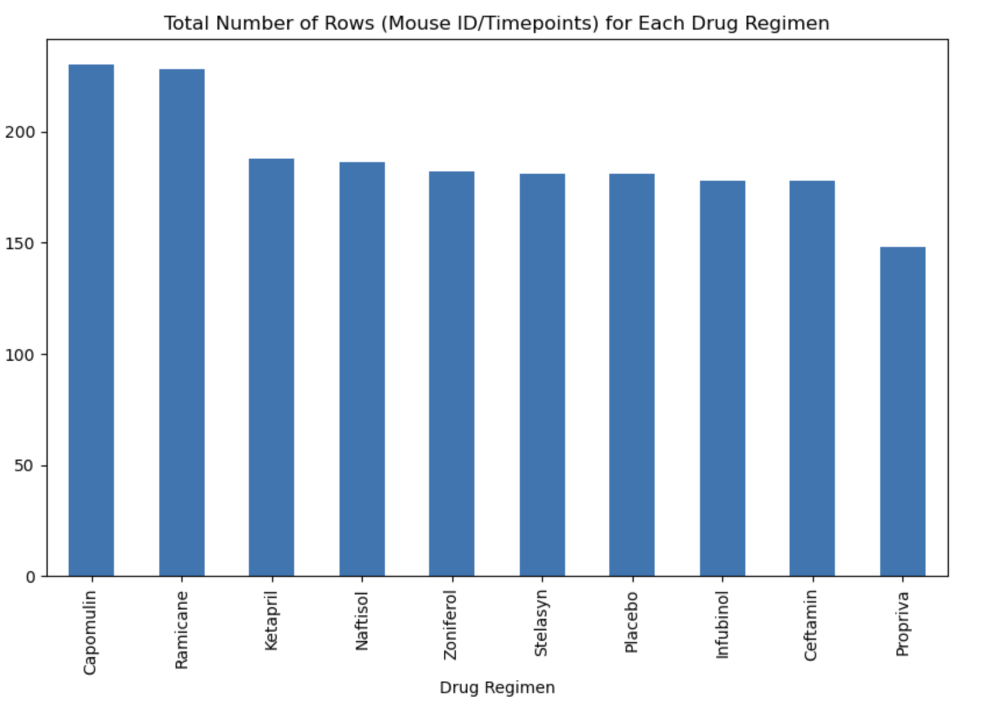
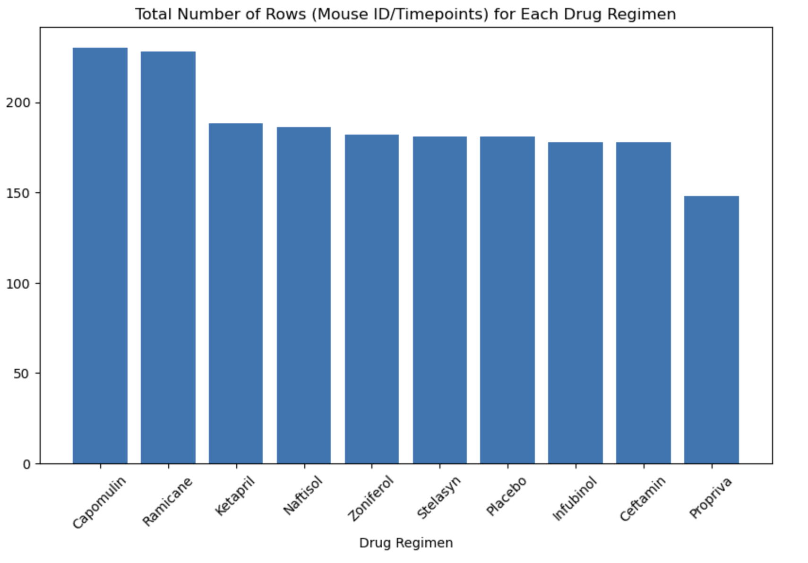
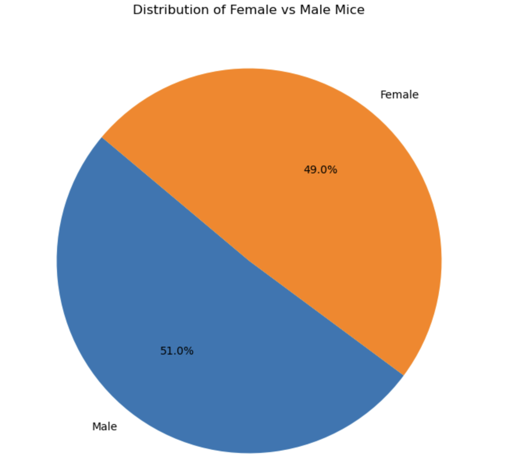
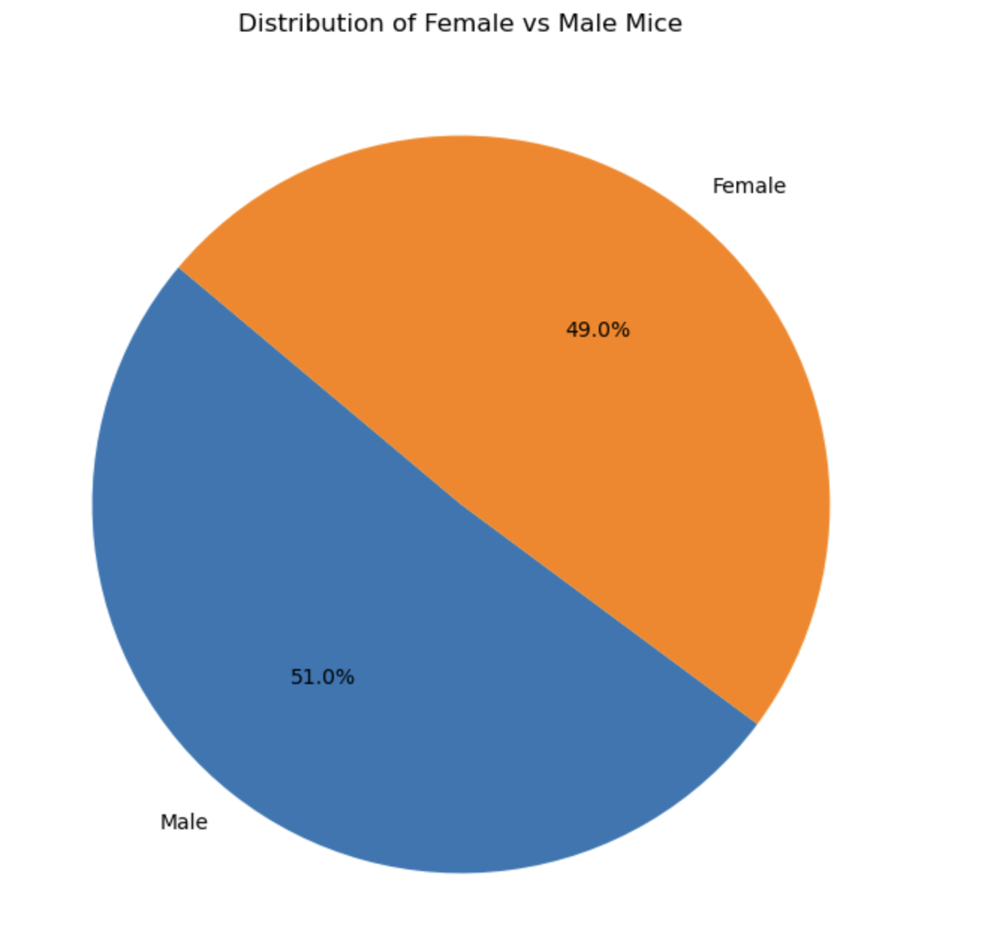
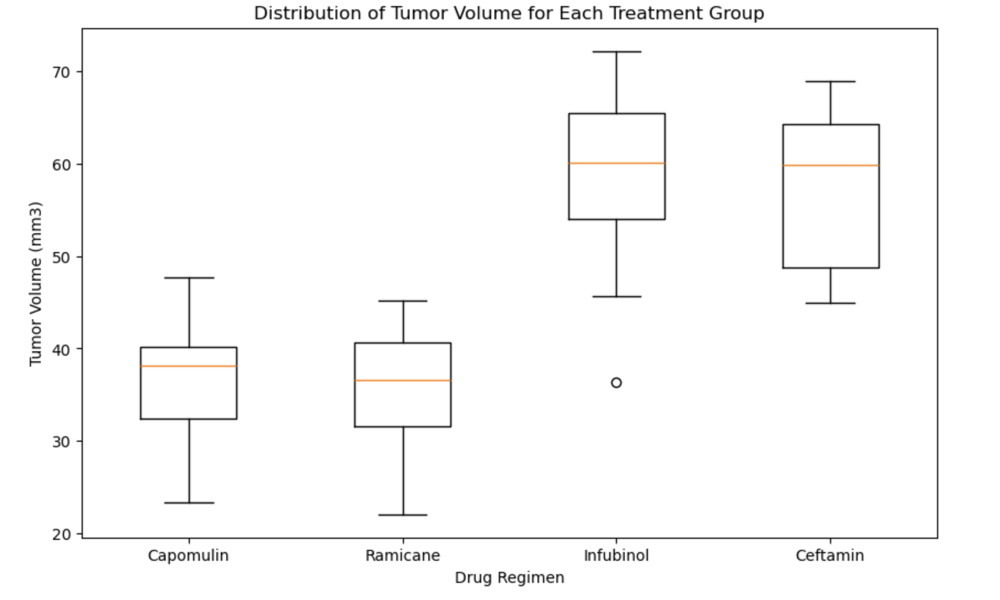
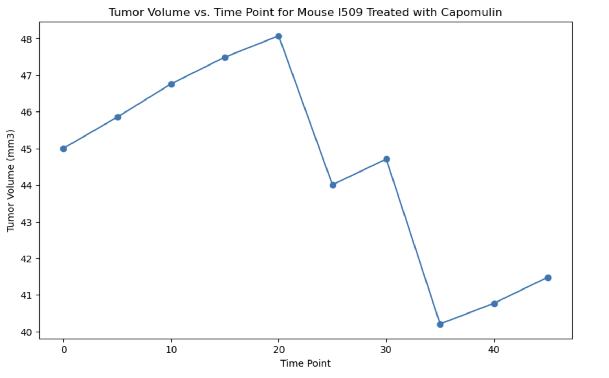
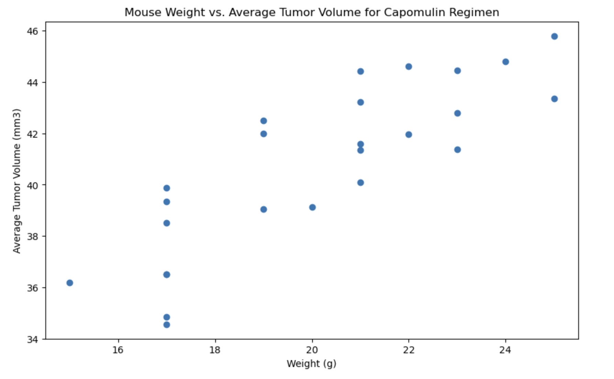
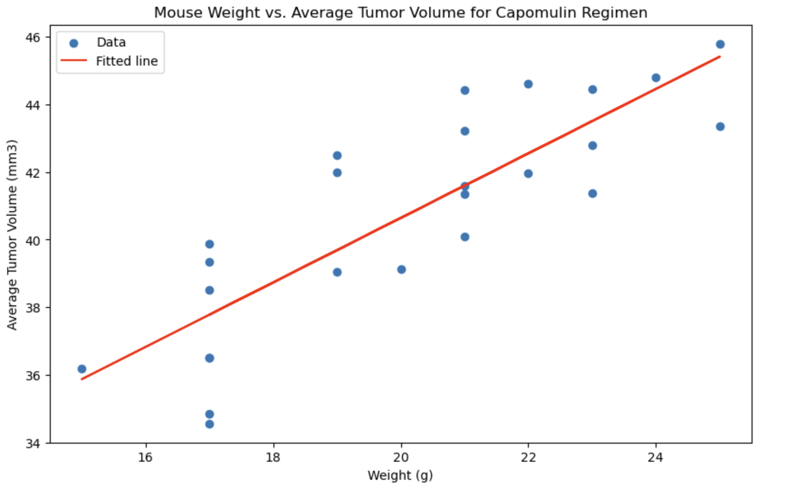

# Pymaceuticals Inc. Clinical Data Analysis

## Overview

Data analysis of a clinical study conducted by Pymaceuticals Inc. The study observed 249 mice who were treated with different drug regimens to assess the effectiveness of Capomulin in comparison to other treatments. The analysis involves tasks such as preparing the data, generating summary statistics, creating various plots (bar, pie, box, line, scatter), and calculating correlations and regressions to help Pymaceuticals' executive team evaluate the drug's performance.

## Files

- `Mouse_metadata.csv`: Metadata for the mice.
- `Study_results.csv`: Data from the study, including time points, tumor volumes, and drug regimens.

## Instructions

The analysis is divided into the following sections:

### 1. Prepare the Data
- Merge the `Mouse_metadata.csv` and `Study_results.csv` datasets.
- Identify any duplicate mouse IDs and remove them to clean the dataset.
- Display the number of unique mice IDs before and after data cleaning.

---

## Data Cleaning

The data was loaded, read, combined, and cleaned by removing any duplicate mouse entries. The cleaned data includes the following columns: `Mouse ID`, `Drug Regimen`, `Sex`, `Age_months`, `Weight (g)`, `Timepoint`, `Tumor Volume (mm3)`, and `Metastatic Sites`. Below is a preview of the cleaned data:

| Mouse ID | Drug Regimen | Sex   | Age_months | Weight (g) | Timepoint | Tumor Volume (mm3) | Metastatic Sites |
|----------|--------------|-------|------------|------------|-----------|--------------------|------------------|
| k403     | Ramicane     | Male  | 21         | 16         | 0         | 45.000000          | 0                |
| k403     | Ramicane     | Male  | 21         | 16         | 5         | 38.825898          | 0                |
| k403     | Ramicane     | Male  | 21         | 16         | 10        | 35.014271          | 1                |
| k403     | Ramicane     | Male  | 21         | 16         | 15        | 34.223992          | 1                |
| k403     | Ramicane     | Male  | 21         | 16         | 20        | 32.997729          | 1                |

---

### 2. Generate Summary Statistics
- Calculate the mean, median, variance, standard deviation, and standard error of the mean (SEM) for the tumor volume for each drug regimen.

  | Drug Regimen | Mean       | Median     | Variance   | Std Dev    | SEM       |
|--------------|------------|------------|------------|------------|-----------|
| Capomulin    | 40.675741  | 41.557809  | 24.947764  | 4.994774   | 0.329346  |
| Ceftamin     | 52.591172  | 51.776157  | 39.290177  | 6.268188   | 0.469821  |
| Infubinol    | 52.884795  | 51.820584  | 43.128684  | 6.567243   | 0.492236  |
| Ketapril     | 55.235638  | 53.698743  | 68.553577  | 8.279709   | 0.603860  |
| Naftisol     | 54.331565  | 52.509285  | 66.173479  | 8.134708   | 0.596466  |
| Placebo      | 54.033581  | 52.288934  | 61.168083  | 7.821003   | 0.581331  |
| Propriva     | 52.320930  | 50.446266  | 43.852013  | 6.622085   | 0.544332  |
| Ramicane     | 40.216745  | 40.673236  | 23.486704  | 4.846308   | 0.320955  |
| Stelasyn     | 54.233149  | 52.431737  | 59.450562  | 7.710419   | 0.573111  |
| Zoniferol    | 53.236507  | 51.818479  | 48.533355  | 6.966589   | 0.516398  |

---

### 3. Create Bar Charts and Pie Charts

#### Bar Charts

The bar charts below visualizes the total number of timepoints for each drug regimen.

- **Bar Chart using Pandas:**

  

- **Bar Chart using Matplotlib:**

  

#### Pie Charts

The pie charts below visualizes the gender distribution of the mice.

- **Pie Chart using Pandas:**

  

- **Pie Chart using Matplotlib:**

  

---

### 4. Calculate Quartiles, Find Outliers, and Create a Box Plot

The final tumor volumes were examined for four drug regimens: Capomulin, Ramicane, Infubinol, and Ceftamin. Quartiles, IQR, and potential outliers were calculated for these regimens.

### Capomulin Tumor Volume Data

| Mouse ID | Timepoint | Tumor Volume (mm3) | Drug Regimen | Sex   | Weight (g) |
|----------|-----------|--------------------|--------------|-------|------------|
| b128     | 45        | 38.982878          | Capomulin    | Female| 22         |
| b742     | 45        | 38.939633          | Capomulin    | Male  | 21         |
| f966     | 20        | 30.485985          | Capomulin    | Male  | 17         |

### Capomulin Quartiles and IQR

Capomulin_tumors = Capomulin_merge["Tumor Volume (mm3)"]
quartiles = Capomulin_tumors.quantile([.25,.5,.75])
lowerq = quartiles[0.25]
upperq = quartiles[0.75]
iqr = upperq - lowerq

The box plot below visualizes the distribution of tumor volumes for the four regimens: Capomulin, Ramicane, Infubinol, and Ceftamin.

- **Box Plot for Tumor Volume Distribution:**

  

### 5. Create a Line Plot and a Scatter Plot

#### Line Plot

The line plot below visualizes the tumor volume of a single mouse treated with Capomulin over time.

- **Line Plot for Tumor Volume Over Time (Mouse l509):**

  

#### Scatter Plot

The scatter plot below visualizes the relationship between mouse weight and average tumor volume for the Capomulin regimen.

- **Scatter Plot of Mouse Weight vs. Average Tumor Volume:**

  

### 6. Calculate Correlation and Regression

# Correlation Coefficient

The correlation coefficient between mouse weight and tumor volume under Capomulin treatment was calculated:
corr = st.pearsonr(avg_capm_vol['Weight (g)'], avg_capm_vol['Tumor Volume (mm3)'])[0]
print(f"Correlation coefficient: {corr}")
Output: 0.84

The scatter plot below visualizes the linear regression model plotted on top of the relationship between mouse weight and tumor volume under the Capomulin regimen.

- **Scatter Plot with Regression Line:**

  

## Analysis Summary

The analysis reveals the following insights:
- The correlation coefficient between mouse weight and average tumor volume for the Capomulin regimen is 0.84, indicating a strong positive correlation.
- The linear regression model suggests that increases in mouse weight are associated with higher tumor volumes under the Capomulin regimen.
- Tumor volume distributions across the four regimens show variability, with only Infubinol having a notable outlier.

## Dependencies

Libraries:
- `matplotlib`
- `pandas`
- `scipy`

